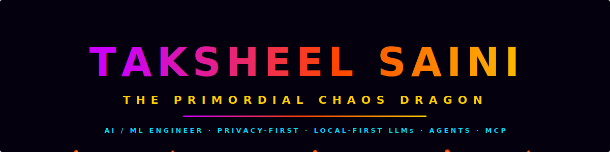
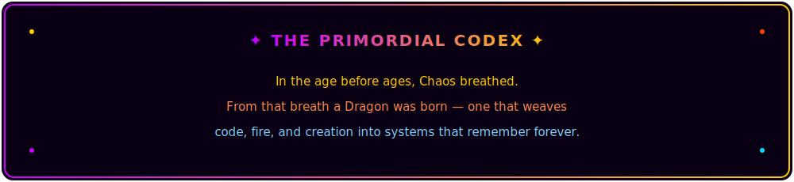
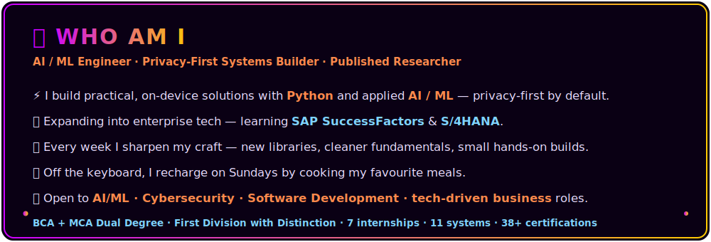
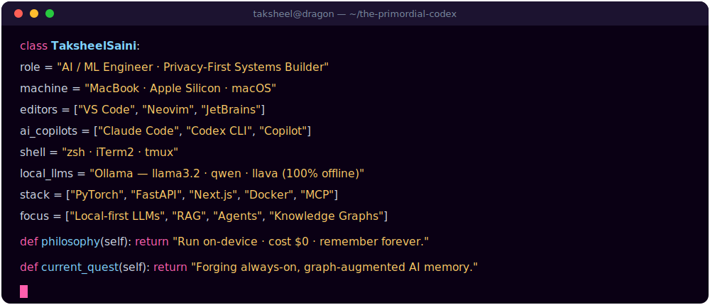
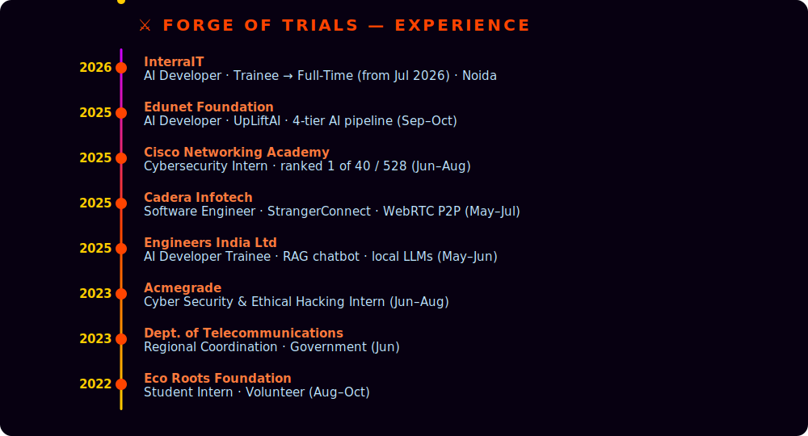
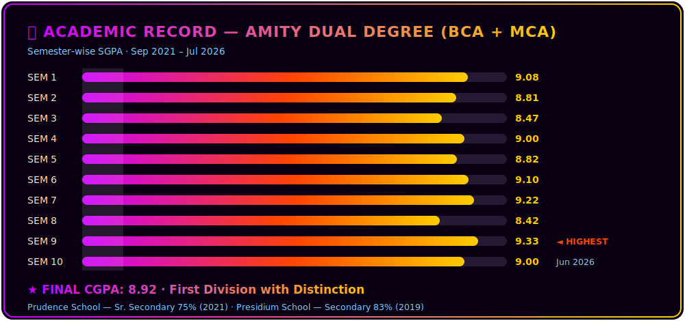
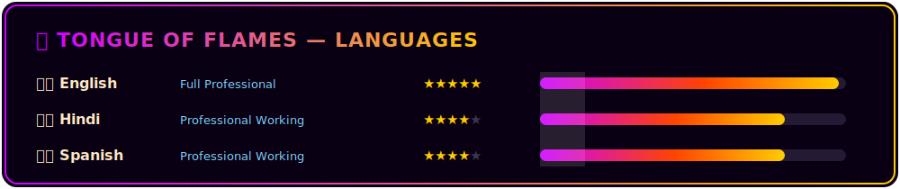

<!-- ░░░ CUSTOM ANIMATED HEADER BANNER (self-authored SVG · assets/header.svg) ░░░ -->
<picture>
  <source media="(prefers-color-scheme: dark)"  srcset="./assets/header.svg">
  <source media="(prefers-color-scheme: light)" srcset="./assets/header-light.svg">
  
</picture>

<!-- ░░░ TYPING ANIMATION ░░░ -->

 

<!-- ░░░ SOCIAL BADGES ░░░ -->

 

---

<picture>
  <source media="(prefers-color-scheme: dark)"  srcset="./assets/codex.svg">
  <source media="(prefers-color-scheme: light)" srcset="./assets/codex-light.svg">
  
</picture>

---

<picture>
  <source media="(prefers-color-scheme: dark)"  srcset="./assets/whoami.svg">
  <source media="(prefers-color-scheme: light)" srcset="./assets/whoami-light.svg">
  
</picture>

> ⚡ **Currently** — AI Developer **@ Interra Information Technologies (InterraIT)**, Noida — joined as a Trainee (Jan–Jun 2026) and **converting to Full-Time from Jul 2026**. Fine-tuned a Microsoft **TrOCR** model (1.3 GB, 4,000+ handwriting samples) into a FastAPI + React OCR pipeline that processes complex images in **under 2 seconds**.

## 🧬 THE DRAGON, AS CODE

<picture>
  <source media="(prefers-color-scheme: dark)"  srcset="./assets/dragoncode.svg">
  <source media="(prefers-color-scheme: light)" srcset="./assets/dragoncode-light.svg">
  
</picture>

## 🛠️ FLAGSHIP SYSTEMS

<b>🜂 GALAXY — Graph-Augmented Code Intelligence & AI Memory Engine</b>

 

> *One always-on graph that remembers every symbol, call, and decision — forever.*

- 🕸️ Parses any repo into a typed knowledge graph across **13 languages** — a 197-file codebase → **1,341 nodes & 40,124 typed relationships**; a 123-file app indexes in **~440 ms**.
- 💥 **Blast-radius** engine traces every symbol affected by a change in **~4 ms**; structural queries return in **~12–40 ms**.
- 🧠 Layered design — parsing → typed code graph → automatic module clustering → hybrid keyword + semantic retrieval — served over a **native MCP server** for Claude / Codex / VS Code.
- ✅ **470 automated tests** · **fully offline · zero API cost**.

`Python` `Tree-sitter` `MCP` `SQLite` `Ollama` `NetworkX` `Graph Intelligence`

<b>🟣 RavenaAI — Privacy-First Obsidian AI Platform</b>

 

> *Total data sovereignty. Zero cloud. Full power.*

- 🔒 Fully self-hosted AI assistant on **Flask + Ollama** — all inference on-device, **~2 s** latency under load; zero data leaves the machine. Synthera FastAPI sidecar reaches full-stack cold-start in **< 1.6 s**.
- 🏗️ Five-pillar architecture: 4-tier model routing · local **RAG** across 5 doc formats · multimodal vision (→ llava) · SSE streaming (15–120 s adaptive) · **GALAXY-backed memory** with NetworkX BFS reasoning + recency half-life decay.
- 🧙 **LLM Council** — 5 advisor personas debate any prompt, peer-review anonymously, and a chairman model synthesises a verdict — entirely local, no API calls.
- 🛡️ Admin auth with hybrid crypto **(Ed25519 + X25519 ECDH + ChaCha20Poly1305)**, full forward secrecy, brute-force lockout.

`Python` `Flask` `Ollama` `RAG` `FAISS` `Cryptography` `Privacy-First`

<b>🔵 RESIDUAL-H — Entropy-Guided Cyber Threat Intelligence</b>

 

> *98.2% ROC-AUC. Real-time. Zero external transmission.*

- 🎯 **98.2% ROC-AUC · 93.3% recall** on CIC-IDS2017 using a 4-model ML ensemble.
- ⚡ Modular backend with **sub-second** real-time predictions — all processing fully offline.
- 🔐 Secure analysis platform with automated reporting; sensitive network data never leaves the host.

`Python` `ML Ensemble` `Cybersecurity` `Anomaly Detection` `Offline`

<b>🟡 KRYPTA — Convergent Speech Intelligence System</b>

 

> *Turn a 3-hour lecture into structured notes in ~4–5 minutes.*

- 🎙️ **~94% transcription accuracy**, supports files up to **200 MB (~3 hrs)**.
- 📝 Five-stage pipeline: **Whisper** (ASR) → **BART** (summary) → **spaCy** (NLP) → notes + quizzes.
- 🔒 End-to-end offline — searchable study material, fully local.

`Python` `Whisper` `BART` `spaCy` `Transformers` `Offline`

<b>🟠 RepoSage — AI-Powered Codebase Intelligence Platform</b>

 

> *Understands your repo, scores its security, and answers with citations.*

- 🗺️ Maps dependencies across **20+ languages**; on every change traces only the affected files (**PageRank** for impact + **BFS** to bound search) — no full rescan.
- 🛡️ Security scoring fuses **Bandit · Semgrep · Trivy** into a single 0–100 severity-weighted score, with false-positive dismissal and category grouping.
- 🔌 **Five LLM providers** behind one interface (Ollama · Anthropic · OpenAI · Gemini · OpenRouter); streamed answers with line-accurate citations; pre-computed summary cuts first response from **~60 s → ~10 s**.

`Python` `FastAPI` `Next.js` `PostgreSQL` `Redis` `Semgrep` `Trivy`

<b>🔮 MORE FORGED SYSTEMS — 6 more from the chaos</b>

 

| System | What it does | Stack |
|---|---|---|
| 🟡 **UpLiftAI** | Privacy-first mental-health assistant · 4 stress domains · 4-tier AI pipeline · 25+ sentiment markers · 8+ crisis helplines · **686+ lines** · 99.9% uptime · <2 s · zero data persistence | `Python` `Streamlit` `VADER` `NLP` `Plotly` |
| 🩷 **SombriaAI** | MobileNetV2 depression detection from facial imagery · real-time prediction · calibrated confidence · privacy-focused research prototype | `Python` `MobileNetV2` `TensorFlow` `Flask` `CV` |
| 🟠 **StrangerConnect** | Anonymous P2P video + text chat · zero registration · intelligent matching · mobile-first · privacy-first | `WebRTC` `Socket.io` `Node.js` `P2P` |
| 🟢 **Quantrix** | Full-stack online compiler · secure isolated execution · microservices · PDF analytics · execution timeouts | `Python` `Flask` `PostgreSQL` `Docker` |
| 🔵 **UrbanSphere** | AI smart-city platform · custom NLP chatbot · secure auth · **team of 4** · recognised for innovation | `Node.js` `Express` `SQL` `NLP` |
| 🟡 **SignaSpectrum** | Real-time dynamic sign-language detection · **0.765 mAP** across 6 gestures · custom SSD MobileNet v2 · 1000+ annotated images · **IEEE Published** | `Python` `TensorFlow` `SSD MobileNet v2` `OpenCV` |

---

## 💼 FORGE OF TRIALS — EXPERIENCE

<picture>
  <source media="(prefers-color-scheme: dark)"  srcset="./assets/timeline.svg">
  <source media="(prefers-color-scheme: light)" srcset="./assets/timeline-light.svg">
  
</picture>

---

## ⚡ TECH ARSENAL

  

**Languages**

**AI / ML · Frameworks**

**Backend · Infra**

**AI Tooling**

**Databases**

**Security**

---

## 📊 CHRONICLE TOWER — GITHUB STATS

---

## 🏅 SEAL ARCHIVES — CERTIFICATIONS

-1BA0D7?style=flat-square&logo=cisco&logoColor=white)

**…and 38+ in total — Oracle · Cisco · AWS · SAP · IBM · Anthropic · MathWorks · Udemy**

---

## 📚 SAGE LIBRARY — PUBLICATIONS

| # | Title | Venue | Year |
|---|---|---|---|
| 1 | **SignaSpectrum: AI-Driven Dynamic Sign Language Detection & Interpretation** | [IEEE · ICRITO 2024](https://ieeexplore.ieee.org) | 2024 |
| 2 | **Cloud Computing Security Issues and Challenges** | [Scopus · CRC Press](https://www.scopus.com/authid/detail.uri?authorId=58689337700) | 2023 |

🔗 **ORCID** [0000-0002-7173-009X](https://orcid.org/0000-0002-7173-009X) &nbsp;·&nbsp; **Scopus** [58689337700](https://www.scopus.com/authid/detail.uri?authorId=58689337700)

---

## 🎓 ACADEMIC RECORD &nbsp;·&nbsp; 🌐 LANGUAGES

<picture>
  <source media="(prefers-color-scheme: dark)"  srcset="./assets/academic.svg">
  <source media="(prefers-color-scheme: light)" srcset="./assets/academic-light.svg">
  
</picture>

<picture>
  <source media="(prefers-color-scheme: dark)"  srcset="./assets/languages.svg">
  <source media="(prefers-color-scheme: light)" srcset="./assets/languages-light.svg">
  
</picture>

---

## 🔥 CONNECT WITH THE DRAGON

Forged with 🔥 chaos and ⚡ lightning · New Delhi, India

